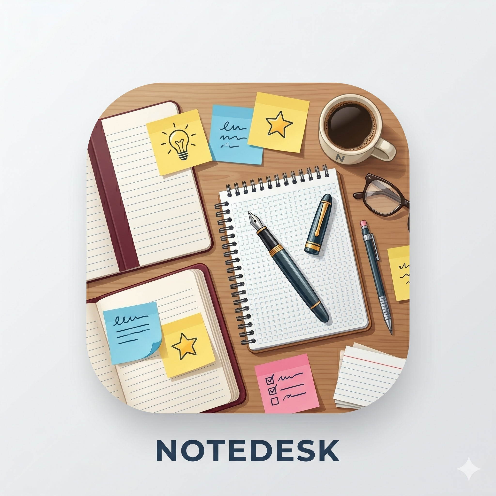

<p align="center">
  
</p>

<h1 align="center">FOSSPad</h1>

<p align="center">
  A free, open-source alternative to OneNote — built with Tauri and React.<br>
  Your notes live as <strong>plain Markdown files</strong> in a folder you own, sync, and version with Git.
</p>

<p align="center">
  <a href="https://github.com/anthropics/note-desk/actions"></a>
  <a href="LICENSE"></a>
  <a href="https://github.com/anthropics/note-desk/releases"></a>
</p>

---

## Why FOSSPad?

Most note-taking apps lock your content in proprietary databases, require subscriptions, or send your data through third-party servers. FOSSPad takes a different approach:

- **You own your data.** Every page is a `.md` file. Every section is a folder. You can read, edit, and move them with any tool.
- **No cloud required.** Notes stay on your machine. Sync them however you want — Git, Syncthing, Dropbox, or nothing at all.
- **Lightweight by design.** Built on Tauri (Rust), not Electron. Expect a small binary and low memory usage.
- **Cross-platform.** Runs natively on macOS, Linux, and Windows.

## Features

- **OneNote-style organization** — Notebooks, Sections, and Pages with colored tabs
- **Live WYSIWYG editing** — Click a block to edit Markdown; click away to see it rendered
- **Syntax-highlighted code blocks** — JS/TS, Python, Rust, Go, Java, C, SQL, Bash, and more
- **Mermaid diagrams** — Write `mermaid` fenced blocks and see them rendered inline
- **Images and video embeds** — Inline images, YouTube embeds, direct video links
- **Full GFM support** — Tables, task lists, strikethrough, blockquotes
- **YAML front-matter tags** — Tag pages and search/filter by tag
- **Full-text search** — Search across every page in the workspace
- **Built-in Git integration** — Init, clone, commit, push, and pull from the Settings panel
- **Encrypted credential storage** — Git tokens are AES-256-GCM encrypted at rest
- **Auto-save** — Changes persist after 1.5 seconds of inactivity
- **Customizable themes** — Light, Dark, Solarized, Nord presets, or define your own colors
- **Markdown import** — Import existing `.md` files into any section

## Workspace Structure

FOSSPad stores everything as plain files and folders:

```text
my-notes/                   ← workspace root (you choose this)
├── .notedesk/              ← app settings & encrypted credentials
│   ├── settings.json
│   └── credentials.json
├── my-notebook/            ← notebook (folder)
│   ├── .notebook.json      ← metadata (display name, tab color)
│   ├── General/            ← section (folder)
│   │   ├── Welcome.md      ← page (Markdown file)
│   │   └── Todo.md
│   └── Research/
│       └── Links.md
└── work/
    ├── .notebook.json
    └── Meetings/
        └── 2024-01-15.md
```

## Installation

Download the latest build for your platform from the [Releases page](https://github.com/anthropics/note-desk/releases), or grab a CI artifact from the [Actions tab](https://github.com/anthropics/note-desk/actions).

| Platform | Formats |
| --- | --- |
| **macOS** (Apple Silicon) | `.dmg`, `.app` |
| **Linux** (x64, arm64) | `.deb`, `.AppImage` |
| **Windows** (x64) | `.exe` (NSIS installer), `.msi` |

> **macOS note:** The app is not signed with an Apple Developer certificate. After installing, you will need to remove the quarantine attribute:
>
> ```bash
> xattr -d com.apple.quarantine /Applications/FOSSPad.app
> ```

For detailed setup instructions per platform, see [docs/installation.md](docs/installation.md).

## Quick Start

1. Download and install FOSSPad for your platform (see above).
2. Launch the app. You'll be prompted to choose or create a workspace folder.
3. Create your first notebook — pick a name and tab color.
4. Start writing! Click any block to edit raw Markdown, click away to render.

For more detail, see the [Quick Start guide](docs/quickstart.md).

## Development

```bash
git clone https://github.com/anthropics/note-desk.git
cd note-desk
npm install
npm run tauri dev
```

This launches the app in development mode with hot-reload. See [docs/development.md](docs/development.md) for full prerequisites, build commands, and project structure.

## Contributing

Contributions are welcome! Please:

1. Fork the repository and create a feature branch.
2. Make your changes and ensure `npx tsc --noEmit` passes.
3. Run `cargo check` in `src-tauri/` to verify the Rust backend.
4. Submit a pull request with a clear description of what changed and why.

For architecture details and where to find things in the codebase, see [docs/architecture.md](docs/architecture.md).

## License

[MIT](LICENSE) — Copyright (c) 2026 David Danielsson
